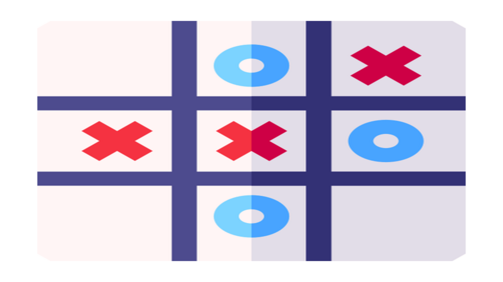

# 🎮 Tic-Tac-Toe PWA

A beautiful, animated Tic-Tac-Toe game built with React, TypeScript, and Tailwind CSS. Features stunning animations, modern design, and Progressive Web App (PWA) capabilities.



## ✨ Features

- 🎨 **Beautiful Animations** - Smooth transitions and hover effects
- 📱 **Responsive Design** - Works perfectly on desktop, tablet, and mobile
- 🌙 **Dark Theme** - Modern dark gradient background
- ⚡ **Fast Performance** - Built with Vite for lightning-fast development
- 🎯 **TypeScript** - Full type safety and better development experience
- 🎪 **Interactive UI** - Engaging game board with visual feedback
- 📦 **PWA Ready** - Can be installed as a native app


## 🛠️ Tech Stack

- **Frontend**: React 19 + TypeScript
- **Styling**: Tailwind CSS
- **Build Tool**: Vite
- **Routing**: React Router DOM
- **PWA**: Service Worker + Web App Manifest


### Prerequisites

- Node.js (v18 or higher)
- npm or yarn

### Setup Instructions

1. **Clone the repository**
   ```bash
   git clone https://github.com/your-username/tictactoe.git
   cd tictactoe
   ```

2. **Install dependencies**
   ```bash
   cd frontend
   npm install
   ```

3. **Start development server**
   ```bash
   npm run dev
   ```

4. **Open in browser**
   Navigate to `http://localhost:5173`

## 🎮 How to Play

1. **Start the Game**: Click the "🎮 Start Game" button on the homepage
2. **Take Turns**: Players take turns placing X's and O's on the 3x3 grid
3. **Win Condition**: Get three of your marks in a row (horizontally, vertically, or diagonally)
4. **Tie Game**: If all squares are filled without a winner, it's a tie


If you have any questions or need help:

- 🐛 **Report Bugs**: [Create an issue](https://github.com/abdelishha/tictactoe/issues)
- 📧 **Contact**: abdelishha@gmail.com


**Made with ❤️ using React, TypeScript, and Tailwind CSS**
